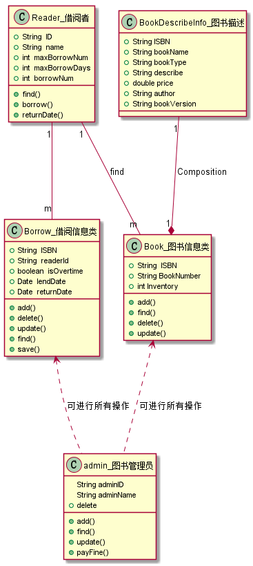
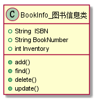
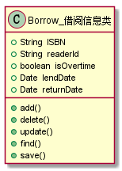
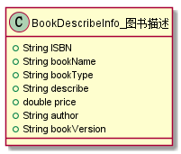

|学号|班级|学生|照片|
|:-------:|:-------------: | :----------:|:---:|
|201510414424|软件(本)15-4|袁松||
#项目3图书管理系统领域对象建模
###  UML源码如下：

``` class
@startuml
class Borrow_借阅信息类{
    +String  ISBN
    +String  readerId
    +boolean  isOvertime
    +Date  lendDate
    +Date  returnDate
    +add()
    +delete()
    +update()
    +find()
    +save()
}

class Reader_借阅者{
    +String  ID
    +String  name
    +int  maxBorrowNum
    +int  maxBorrowDays
    +int  borrowNum
    +find()
    +borrow()
    +returnDate()
}
class Book_图书信息类{
    +String  ISBN
    +String BookNumber
    +int Inventory
    +add()
    +find()
    +delete()
    +update()
}
class BookDescribeInfo_图书描述{
    +String ISBN
    +String bookName
    +String bookType
    +String describe
    +double price
    +String author
    +String bookVersion
}
class admin_图书管理员{
    String adminID
    String adminName
    +add()
    +find()
    +update()
    +delete
    +payFine()
}
```

###  类图如下：



``` 

### 图书信息类的对象图
#### 源码如下：
``` class
@startuml
class Book_图书信息类{
        +String  ISBN
        +String BookNumber
        +int Inventory
        +add()
        +find()
        +delete()
        +update()
}
@enduml
``` 
#### 对象图如下：


#### 注释：
``` 
图书信息类：
    属性：
        ISBN：书号
        BookNumber：图书编号
        Inventory：库存
    方法：
        add()：添加图书
        find()：查找图书
        delete()：删除图书
        update()：更新图书
``` 

### 借阅者类的对象图
#### 源码如下：
``` class
class Reader_借阅者{
    +String  ID
    +String  name
    +int  maxBorrowNum
    +int  maxBorrowDays 
    +int  borrowNum
    +find()
    +borrow()
    +returnDate()
}
``` 
#### 对象图如下：


#### 注释：
``` 
借阅者类：
    属性：
        ID：借阅者号
        name：借阅者姓名
        maxBorrowNum：最大借书量
        maxBorrowDays：最大借书时限
        borrowNum：借书数量
    方法：
        find()：查找图书
        returnDate()：还书日期
        borrow()：借书
``` 

### 借阅信息类的对象图
#### 源码如下：
``` class
@startuml
class Borrow_借阅信息类{
    +String  ISBN
    +String  readerId
    +boolean  isOvertime
    +Date  lendDate
    +Date  returnDate
    +add()
    +delete()
    +update()
    +find()
    +save()
}
@enduml
``` 
#### 对象图如下：


#### 注释：
``` 
借阅信息类：
    属性：
        ISBN：书号
        readerId：借阅者号
        isOvertime：是否超出时限
        lendDate：借书日期
        returnDate：还书日期
    方法：
        add()：添加图书
        find()：查找图书
        delete()：删除图书
        update()：更新图书
        save()：保存操作
``` 

###  图书管理员类的对象图
#### 源码如下：
``` class
@startuml
class admin_图书管理员{
    String adminID
    String adminName
    +add()
    +find()
    +update()
    +delete
    +payFine()
}
@enduml
``` 
#### 对象图如下：


#### 注释：
``` 
图书管理员类：
    属性：
        adminID：图书管理员编号
        adminName：图书管理员姓名
    方法：
        add()：添加图书
        find()：查找图书
        delete()：删除图书
        update()：更新图书
        payFine()：罚金缴纳
``` 

###  图书描述类的对象图
#### 源码如下：
``` class
@startuml
class BookDescribeInfo_图书描述{
    +String ISBN
    +String bookName
    +String bookType
    +String describe
    +double price
    +String author
    +String bookVersion
}
@enduml
``` 
#### 对象图如下：
#### 注释：
``` 
图书描述类：
    属性：
        ISBN：书号
        bookName：图书名称
        bookType：图书类型
        bookVersion：图书版本
        describe：图书描述
        price：价格
        author：作者
``` 




``` 
